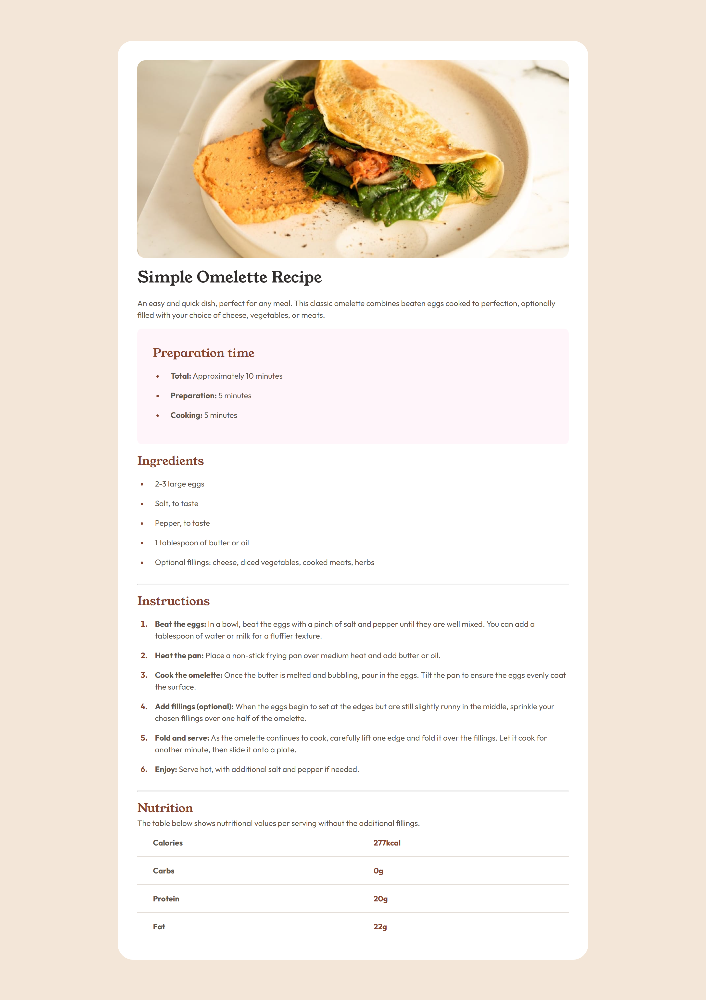
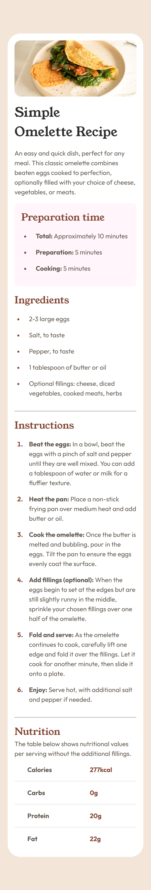

# Frontend Mentor - Recipe page solution

This is a solution to the [Recipe page challenge on Frontend Mentor](https://www.frontendmentor.io/challenges/recipe-page-KiTsR8QQKm). Frontend Mentor challenges help you improve your coding skills by building realistic projects.

## Table of contents

- [Overview](#overview)
  - [Screenshot](#screenshot)
  - [Links](#links)
- [My process](#my-process)
  - [Built with](#built-with)
  - [What I learned](#what-i-learned)
  - [Useful resources](#useful-resources)
- [Author](#author)

## Overview

### Screenshot

| Desktop View                  | Mobile View                  |
| ----------------------------- | ---------------------------- |
|  |  |

### Links

[Live Site URL](https://kapteynuniverse.github.io/Recipe-Page/)

[Solution URL](https://www.frontendmentor.io/solutions/second-challenge-recipe-page-MsRzjKn1AA)

## My process

### Built with

- Semantic HTML5 markup
- CSS custom properties
- Mobile-first workflow
- Flexbox

### What I learned

While building this project, I improved my understanding of:

- **The Table element**: How to structure tabular data semantically using `<table>`, `<thead>`, `<tbody>`, and `<tr>`, and when it's appropriate to use tables instead of other layout methods.
- **Clamp function**: How to create responsive values (like font sizes and spacing) using `clamp()` to smoothly scale between minimum and maximum values based on viewport size.
- **`:nth-child()` selector**: Used `:nth-child(2)` to target specific elements for styling.

### Useful resources

- [The Table element](https://developer.mozilla.org/en-US/docs/Web/HTML/Reference/Elements/table) : A solid reference for understanding proper table structure and accessibility.
- [You Don’t Know HTML Tables](https://blog.frankmtaylor.com/2026/03/05/you-dont-know-html-tables/): A deeper dive into table semantics, structure, and best practices that helped reinforce proper usage.
- [Clamp function](https://developer.mozilla.org/en-US/docs/Web/CSS/Reference/Values/clamp) : Helped me understand how `clamp()` works and when to use it.
- [Clamp calculator](https://www.marcbacon.com/tools/clamp-calculator/) : Very useful for generating responsive `clamp()` values quickly.
- [:nth-child()](https://developer.mozilla.org/en-US/docs/Web/CSS/Reference/Selectors/:nth-child) : A helpful guide for targeting elements based on their position in the DOM.

## Author

- Frontend Mentor - [Asilcan Toper](https://www.frontendmentor.io/profile/KapteynUniverse)
